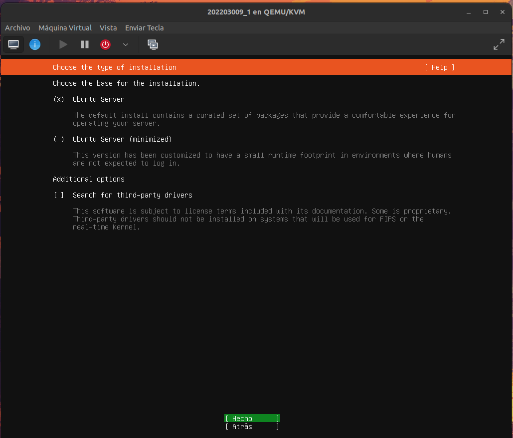
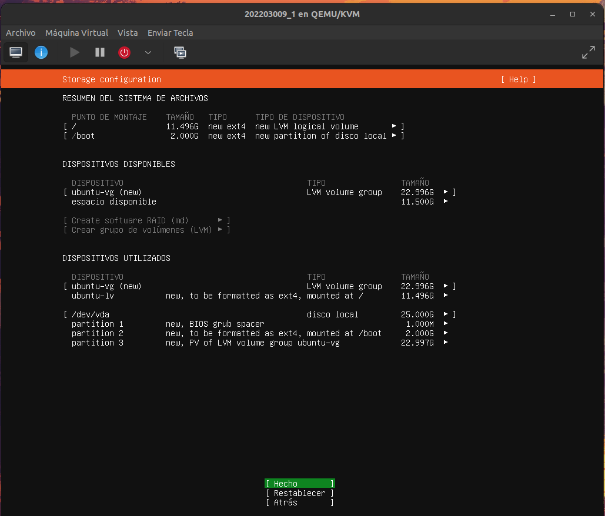

# Manual y guia de instalacion

#### Nombre: Mateo Estuardo Diego Noriega
#### Carnet: 202203009


## Creacion maquinas virtuales

Para la creacion de las maquinas virtuales simplemente basta con abrir el gestor de maquinas virtuales que se instalo.

Una vez dentro se selecciona el boton de crear maquina virtual, donde se debera de seleccionar la imagen del archivo ISO que se utilizara para la instalacion del sistema.


Se nos muestra la configuracion de memoria para la maquina, modifique a su criterio.

posterior a ello, se nos muestran mas opciones para el almacenamiento de la maquina, que nuevamente vuelve a quedar al criterio del usuario.


Una vez realizada las configuraciones de memoria, se le asigna el nombre a la maquina virtual, en este caso al ser la primera de las tres maquinas que se deberan usar, se le asignara el `carnet_#`, por lo tanto para esta se usara `202203009_1`


Una vez realizado este paso se abrira una pantalla en la cual se debera seleccionar la primera opcion, es decir  `install Ubuntu Server`.


Se selecciona Ubuntu server y luego hecho.


Si el sistema necesita un proxy para conectar a internet debera de escribirse el proxy, sin embargo, en nuestro caso no es neceario, por lo que solo se omite, darle a `Hecho`.


Una vez realizadaos los pasos anteriores se muestran los detalles sobre la instalacion.


Se introducen los datos de la maquina virtual, en las tres maquinas virtuales se utilizo un usuario `matius`, el nombre del servidor tampoco es relevante, sin embargo, para tener un mejor orden y por ser esta la primer maquina, se le puso `carnet_#`, para este caso `202203009_1`, el nombre de usuario que tambien es indiferente, pero por facilidad se le pondra el mismo que se uso anteriormente `matius` y por ultimo una contrasenia, que tambien por facilidad se recomienda que sea una sencilla.


Posterior a ello, realizados todos estos pasos, se podra observar esta pantalla, solo darle `enter`.


Una vez hecho esto, la maquina quedara configurada para su uso.


Este proceso se repite para cada maquina, y con esto se tendran creadas tres maquinas, las cuales son:

- 202203009_1
- 202203009_2
- 202203009_3

con las mismas credenciales:
usuario: `matius`
contrasenia: `1234`


La creacion de dichas maquinas virtuales nos servira para hacer las respectivas conexiones que solicita el proyecto, el esquema a seguir es el siguiente:


En nuestro caso se decidio dividirlo de la siguiente manera:

- Maquina con 1 contenedor `202203009_1`
- Maquina 2 contenedores `202203009_2`
- Maquina 3 con zot `202203009_3`

Cabe mencionar que de las maquinas que tendran instalado docker son la maquina `host` y la `202203009_3` es decir, la maquina 3, de la misma manera la maquina 3 usara zot, en cuanto a las otras dos maquinas tendran docker y containerd.

En resumen, la maquina 3, contenera (valga la redundancia) los contenedores y se las suministrara a las otras dos maquinas, dichas vms ejecutaran los contendores y se conectaran entre si.

En el caso de la maquina 1 y 2, haremos uso de `containerd`, para lo cual repetiremos el mismo proceso para ambos equipos.

### Instalacion containerd (para maquina 1 y 2)

```bash
sudo apt install -y containerd
```

### Configuracion containerd

```bash
sudo mkdir -p /etc/containerd
sudo containerd config default | sudo tee /etc/containerd/config.toml
sudo systemctl restart containerd
sudo systemctl enable containerd
```
Por ultimo, para verificar que se haya instalado correctamente nos apoyaremos del siguiente comando:

```bash
sudo systemctl status containerd
```
para ver la version:

```bash
ctr --version
```

## Maquina 1 - 202203009_1
Una vez realizados los pasos anteriores, desde la maquina host, se debera crear una carpeta para la api de la maquina, se recomienda que se le coloque un nombre que lo identifique, en este caso sera `api1`.

una vez dentro de la carpeta se ejecutara el siguiente comando para inciar el proyecto de go:

```go
go mod init Nombre_Proyecto
```

En nuestro el nombre sera el mismo que el de la carpeta, es decir `api1`. Dicho modulo es necesario para que nuestros programas en go funcionen correctamente.

Ahora, nos apoyaremos del siguiente comando para crear el archivo `main.go`.

```bash
touch main.go
```

Una vez hecho esto se nos creara el main de nuestro proyecto. Ahora ya tenemos todo lo necesario para empezar. Hay varias maneras de modificar el main, pero al estar trabajando el main desde la maquina host, en este caso se trabajo desde vsc.

Al culminar con la realizacion de la api el siguiente paso es crear un `dockerfile`, la razon es que para que nosotros podamos construir una imagen de docker que es lo que usaremos para crear contendores, necesitamos crear un archivo dockerfile, y eso siempre en el mismo lugar donde esta nuestro codigo porque de esta manera se puede acceder al codigo mas facilmente.

Por lo tanto el siguiente paso es crear un dockerfile, y dentro de este pondremos lo siguiente:

```docker
FROM golang:1.23-alpine

# Configuración del entorno
WORKDIR /app
COPY . .

# Instalar dependencias 
RUN go mod download

# Compilar
RUN CGO_ENABLED=0 GOOS=linux go build -o server .

# Puerto expuesto (debe ser el mismo que el del servidor)
EXPOSE 80

# Comando de ejecución
CMD ["/app/server"]
```
Explicando el contenido del dockerfile, primero tenemos lo siguiente:

```docker
FROM golang:1.23-alpine
```
Es para ir a buscar la imagen que utilizaremos, la version es la version de go con la que estamos trabajando. El -alpine, hace que se descargue una imagen liviana y que trae todo lo necesario.

```docker
WORKDIR /app
COPY . .
```
Con esto creamos una carpeta dentro de nuestro contenedor llamada `app`, y dentro de `/app` nos ayudaremos con el `COPY` para copiar todo lo que esta en la carpeta donde nos encontramos hacia la carpeta de nuestro contenedor.

Resumiendo, creamos un directorio llamado app dentro del contenedor, el contenedor es practicamente un mini SO en el que vamos a crear lo necesario para crear nuestras aplicaciones.

Luego con el COPY copiaremos todos los archivos de nuestro directorio local hacia dentro del contenedor.

```docker
# Instalar dependencias 
RUN go mod download
```

Esta instruccion se utiliza por si acaso hay alguba dependencia que deba descargar go.

```docker
# Compilar
RUN CGO_ENABLED=0 GOOS=linux go build -o server .
```
Este comando va a deshabilitar cualquier tipo de compilacion externa de go porque nosotros vamos a compilar codigo dentro del contendor para que se ejecute dentro de el, entonces no necesita acceder a ninguna dependencia externa porque se supone que ya esta todo dentro del codigo que nosotros podamos necesitar y se descargo anteriormente con el `RUN`. Asimismo le decimos que estamos trabajando sobre un sistema linux.

El `go build` crea todo dentro de un binario llamado server y lo va a crear justo donde estamos, es decir, en `/app`.

Por ultimo debemos de exponer el puerto:

```docker
# Puerto expuesto (debe ser el mismo que el del servidor)
EXPOSE 80
```

Si no exponemos el puerto, la aplicacion no se podra conectar con nuestra computadora, el contenedor va a correr pero cuando quereamos que se comunique con otras maquinas no va a poder porque no esta expuesto.


```docker
# Comando de ejecución
CMD ["/app/server"]
```

Es el comando que va a estar ejecutando el codigo siempre, su diferencia con RUN es que `RUN` se ejecuta dentro del contenedor a la hora de crearse pero una vez creado ya no ejecuta nada del resto, por otro lado `CMD` se ejecuta al final de todo lo anterior. Por ultimo, ejecuta server, es decir, el binario creado anteriormente.

### Creacion imagen de docker
Para crear la imagen de docker usaremos el siguiente comando:

```docker
#docker build -t nombre_imagen:tag .

docker build -t api1:pesada .
```
Ahora si se ejecuta el siguiente comando, podra obserbarse las imagenes que tenemos actualmente:

```docker
docker images
```

Y efectivamente, puede observarse que la imagen de la api1 se ha creado con exito.


Ahora lo probaremos, y para ello levantaremos el servicio con el siguiente comando:

````docker
#docker run -d -p puerto_host:puerto_docker nombre_imagen:tag

docker run -d -p 8080:80 api1:pesada
````

Donde `8080` es el puerto que vamos a usar en nuestra maquina local, mientras que el `80` es de nuestro contenedor, y vamos a usar la imagen de api1, muy `importante`, recordar siempre poner el tag, porque de no hacerlo puede dar algunos problemas. 

Ahora con ayuda de un `docker ps` podemos ver los detalles del contenedor

Seguidamente podemos ejecutar:

```docker
curl http://localhost:8080
```

Sin embargo, esta imagen es muy pesada, pero hay una forma de volverla mas liviana, y es de la siguiente manera:

```docker
FROM golang:1.23-alpine AS builder

# Configuración del entorno
WORKDIR /app

COPY go.mod .
#COPY go.sum .

# Instalar dependencias
RUN go mod download

COPY . .

RUN go mod tidy

# Compilar
RUN CGO_ENABLED=0 GOOS=linux go build -o /app/api .
#Ahora se guarda nuestro archivo en la carpeta app con el nombre api

#este runtime se encarga de correr la aplicación,
#mientras que el otro se encarga de construir 
#runtime stage
FROM alpine:3.22

WORKDIR /app

COPY --from=builder /app/api .

# Puerto expuesto (debe ser el mismo que el del servidor)
EXPOSE 8081

# Comando de ejecución
CMD ["./api"]
```

## Maquina 2 - 202203009_2
Una vez realizados los pasos anteriores, desde la maquina host, se debera crear una carpeta para la api de la maquina, se recomienda que se le coloque un nombre que lo identifique, en este caso sera `api1`.

una vez dentro de la carpeta se ejecutara el siguiente comando para inciar el proyecto de go:

```go
go mod init Nombre_Proyecto
```

En nuestro el nombre sera el mismo que el de la carpeta, es decir `api1`. Dicho modulo es necesario para que nuestros programas en go funcionen correctamente.

Ahora, nos apoyaremos del siguiente comando para crear el archivo `main.go`.

```bash
touch main.go
```

Una vez hecho esto se nos creara el main de nuestro proyecto. Ahora ya tenemos todo lo necesario para empezar. Hay varias maneras de modificar el main, pero al estar trabajando el main desde la maquina host, en este caso se trabajo desde vsc.

Al culminar con la realizacion de la api el siguiente paso es crear un `dockerfile`, la razon es que para que nosotros podamos construir una imagen de docker que es lo que usaremos para crear contendores, necesitamos crear un archivo dockerfile, y eso siempre en el mismo lugar donde esta nuestro codigo porque de esta manera se puede acceder al codigo mas facilmente.

Por lo tanto el siguiente paso es crear un dockerfile, y dentro de este pondremos lo siguiente:

```docker
FROM golang:1.23-alpine

# Configuración del entorno
WORKDIR /app
COPY . .

# Instalar dependencias 
RUN go mod download

# Compilar
RUN CGO_ENABLED=0 GOOS=linux go build -o server .

# Puerto expuesto (debe ser el mismo que el del servidor)
EXPOSE 80

# Comando de ejecución
CMD ["/app/server"]
```
Explicando el contenido del dockerfile, primero tenemos lo siguiente:

```docker
FROM golang:1.23-alpine
```
Es para ir a buscar la imagen que utilizaremos, la version es la version de go con la que estamos trabajando. El -alpine, hace que se descargue una imagen liviana y que trae todo lo necesario.

```docker
WORKDIR /app
COPY . .
```
Con esto creamos una carpeta dentro de nuestro contenedor llamada `app`, y dentro de `/app` nos ayudaremos con el `COPY` para copiar todo lo que esta en la carpeta donde nos encontramos hacia la carpeta de nuestro contenedor.

Resumiendo, creamos un directorio llamado app dentro del contenedor, el contenedor es practicamente un mini SO en el que vamos a crear lo necesario para crear nuestras aplicaciones.

Luego con el COPY copiaremos todos los archivos de nuestro directorio local hacia dentro del contenedor.

```docker
# Instalar dependencias 
RUN go mod download
```

Esta instruccion se utiliza por si acaso hay alguba dependencia que deba descargar go.

```docker
# Compilar
RUN CGO_ENABLED=0 GOOS=linux go build -o server .
```
Este comando va a deshabilitar cualquier tipo de compilacion externa de go porque nosotros vamos a compilar codigo dentro del contendor para que se ejecute dentro de el, entonces no necesita acceder a ninguna dependencia externa porque se supone que ya esta todo dentro del codigo que nosotros podamos necesitar y se descargo anteriormente con el `RUN`. Asimismo le decimos que estamos trabajando sobre un sistema linux.

El `go build` crea todo dentro de un binario llamado server y lo va a crear justo donde estamos, es decir, en `/app`.

Por ultimo debemos de exponer el puerto:

```docker
# Puerto expuesto (debe ser el mismo que el del servidor)
EXPOSE 80
```

Si no exponemos el puerto, la aplicacion no se podra conectar con nuestra computadora, el contenedor va a correr pero cuando quereamos que se comunique con otras maquinas no va a poder porque no esta expuesto.


```docker
# Comando de ejecución
CMD ["/app/server"]
```

Es el comando que va a estar ejecutando el codigo siempre, su diferencia con RUN es que `RUN` se ejecuta dentro del contenedor a la hora de crearse pero una vez creado ya no ejecuta nada del resto, por otro lado `CMD` se ejecuta al final de todo lo anterior. Por ultimo, ejecuta server, es decir, el binario creado anteriormente.

### Creacion imagen de docker
Para crear la imagen de docker usaremos el siguiente comando:

```docker
#docker build -t nombre_imagen:tag .

docker build -t api1:pesada .
```
Ahora si se ejecuta el siguiente comando, podra obserbarse las imagenes que tenemos actualmente:

```docker
docker images
```

Y efectivamente, puede observarse que la imagen de la api1 se ha creado con exito.


Ahora lo probaremos, y para ello levantaremos el servicio con el siguiente comando:

````docker
#docker run -d -p puerto_host:puerto_docker nombre_imagen:tag

docker run -d -p 8080:80 api1:pesada
````

Donde `8080` es el puerto que vamos a usar en nuestra maquina local, mientras que el `80` es de nuestro contenedor, y vamos a usar la imagen de api1, muy `importante`, recordar siempre poner el tag, porque de no hacerlo puede dar algunos problemas. 

Ahora con ayuda de un `docker ps` podemos ver los detalles del contenedor

Seguidamente podemos ejecutar:

```docker
curl http://localhost:8080
```

Sin embargo, esta imagen es muy pesada, pero hay una forma de volverla mas liviana, y es de la siguiente manera:

```docker
FROM golang:1.23-alpine AS builder

# Configuración del entorno
WORKDIR /app

COPY go.mod .
#COPY go.sum .

# Instalar dependencias
RUN go mod download

COPY . .

RUN go mod tidy

# Compilar
RUN CGO_ENABLED=0 GOOS=linux go build -o /app/api .
#Ahora se guarda nuestro archivo en la carpeta app con el nombre api

#este runtime se encarga de correr la aplicación,
#mientras que el otro se encarga de construir 
#runtime stage
FROM alpine:3.22

WORKDIR /app

COPY --from=builder /app/api .

# Puerto expuesto (debe ser el mismo que el del servidor)
EXPOSE 8081

# Comando de ejecución
CMD ["./api"]
```

### Maquina 3 - 202203009_3
Para dicha maquina, primero que nada se debe de instalar lo necesario para el proyecto, y para ello instalaremos docker.

esto lo haremos con los siguientes comandos:

**Nota**:
Recomiendo que para los comandos se utilice un medio que les facilite el ingreso de estos, puesto que hacerlo de otra manera puede que les complique un poco el proceso.

En este caso lo realice de la siguiente manera:

```bash
ssh usuario@IP_de_la_VM
```
Para conocer la IP de la maquina virtual basta con ingresar el siguiente comando en la terminal de la pc host:

```bash
virsh domifaddr nombre_de_la_VM
```
En este punto se abrira una terminal de la maquina virtual, donde podran ingresarse comando y copiar y pegar como se hace en la consola de la host.

``` bash
# Add Docker's official GPG key:
sudo apt-get update
sudo apt-get install ca-certificates curl
sudo install -m 0755 -d /etc/apt/keyrings
sudo curl -fsSL https://download.docker.com/linux/ubuntu/gpg -o /etc/apt/keyrings/docker.asc
sudo chmod a+r /etc/apt/keyrings/docker.asc

# Add the repository to Apt sources:
echo \
  "deb [arch=$(dpkg --print-architecture) signed-by=/etc/apt/keyrings/docker.asc] https://download.docker.com/linux/ubuntu \
  $(. /etc/os-release && echo "${UBUNTU_CODENAME:-$VERSION_CODENAME}") stable" | \
  sudo tee /etc/apt/sources.list.d/docker.list > /dev/null
sudo apt-get update
```

Adicional a ello, se recomiendo instalar instala Docker Engine y complementos:

```bash
sudo apt-get install docker-ce docker-ce-cli containerd.io docker-buildx-plugin docker-compose-plugin
```

Posterior a la instalacion se debe verificar que la instalacion este correctamente hecha, se hace de la siguiente manera:

```bash
sudo docker run hello-world
```

Si observa un mensaje de bienvenida, significa que la instalacion de Docker ha sido exitosa, de lo contrario, se recomienda seguir los pasos nuevamente.

Por ultimo, tenemos que hacer la configuracion de docker, que realmente este paso puede omitirse, pero por comodidad lo hare.

### Configuracion post-instalacion

Ahora ingresaremos el siguiente comando:

```bash
sudo usermod -aG docker $USER
```

Este comando le permite al usuario ejecutar docker sin necesidad de sudo, esto debido a que el socket /var/run/docker.sock pertenece al grupo docker.

Seguidamente, introducimos los siguientes comandos:

```bash
newgrp docker
```

Esto aplica inmediatamente los cambios de grupo en la sesion actual, sin esto se tendria que cerrar sesion y volver a entrar para que el usuario herede el grupo de docker, en palabras mas simples `recarga los gruos de usuario`.

```bash
sudo systemctl enable docker
```

Con este comando no se tiene que levantar manualmente con `systemctl start docker` tras cada reincio.

y para verificar el estado del servicio de docker solamente usamos:

```bash
sudo systemctl status docker
```

Una vez tengamos instalado docker, ahora podremos iniciar un registro `zot` en segundo plano, exponiendo el puerto 5000, para ello nos apoyaremos del siguiente comando:

```bash
docker run -d -p 5000:5000 --name zot ghcr.io/project-zot/zot-linux-amd64:latest
```

Con eso se descargara la imagen de `zot` y la ejecutara como un contenedor llamado `zot`. 


### Subir imagenes con desde el host a maquina con zot

En la maquina virtual con zot levantaremos zot en el puerto 5000.

EL procedimiento es el siguiente:

```docker

sudo docker ps

curl http://localhost:5000/v2/

curl http://localhost:5000/v2/_catalog
```
En caso de que no funcione, probar con esto:

```bash
sudo docker rm zot


sudo docker run -d --name zot \
  --restart unless-stopped \
  -p 5000:5000 \
  -v /opt/zot/data:/var/lib/registry \
  ghcr.io/project-zot/zot-linux-amd64:latest

#verificar y probar nuevamente
sudo docker ps
curl http://localhost:5000/v2/
curl http://localhost:5000/v2/_catalog

```
Una vez realizado el procedimiento anterior introduciermos esto:

```bash
docker tag api1:liviana 192.168.122.107:5000/api1:liviana
```

Cabe recalcar que dicho comando se ejecuta desde el host. Ahora solo hacemos push:

```bash
docker push 192.168.122.107:5000/api1:liviana
```

Ahora para comprobar que en la maquina virtual ya tenemos la imagen podemos hacer lo siguiente:

```bash
curl http://localhost:5000/v2/_catalog
```

Y ahi se podra ver si realmente se descargo la imagen.


### Llamadas entre APIs

En cada maquina virtual con containerd se debe de realizar este proceso. Para hacer las llamadas dentre las APIs nos ayudaremos de los siguientes comandos:

```bash
#sudo ctr images pull --plain-http IP_VM:5000/NOMBRE_IMAGEN:TAG

sudo ctr images pull --plain-http 192.168.122.107:5000/api1:liviana
```

Ahora, para ejecutar el contenedor en segundo plano usamos lo siguiente:

```bash
#sudo ctr run -d --net-host <IP_VM_DOCKER>:5000/fiber-api-go:v1 NOMBRE_CONTENEDOR_INICIALIZAR

sudo ctr run -d --net-host 192.168.122.107:5000/api1:liviana MI_API_1

```

De esta manera la maquina virtual habra consultado existosamente a la maquina 3.


Ahora, para hacer pruebas entre las otras APIs se hace de la siguiente manera:

```bash
curl http://192.168.122.217:8081/api1/202203009/llamar-api2
curl http://192.168.122.217:8081/api1/202203009/llamar-api3
```

Demostracion de funcionamiento:


