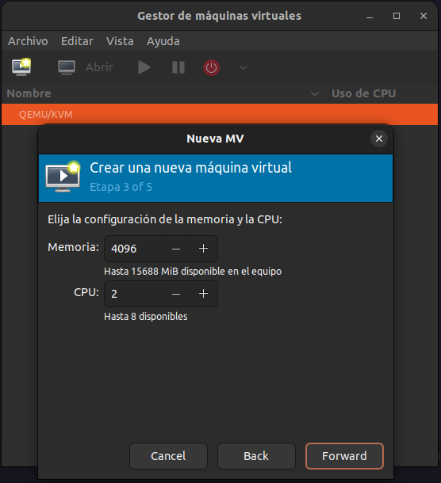
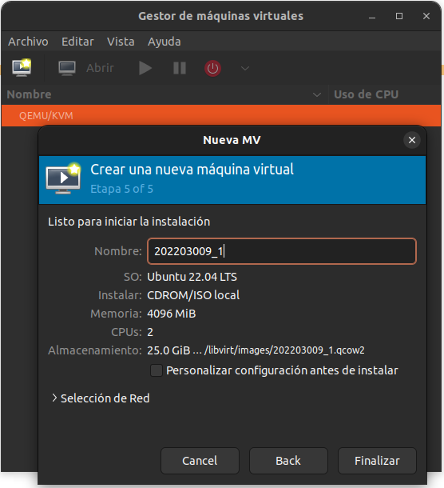
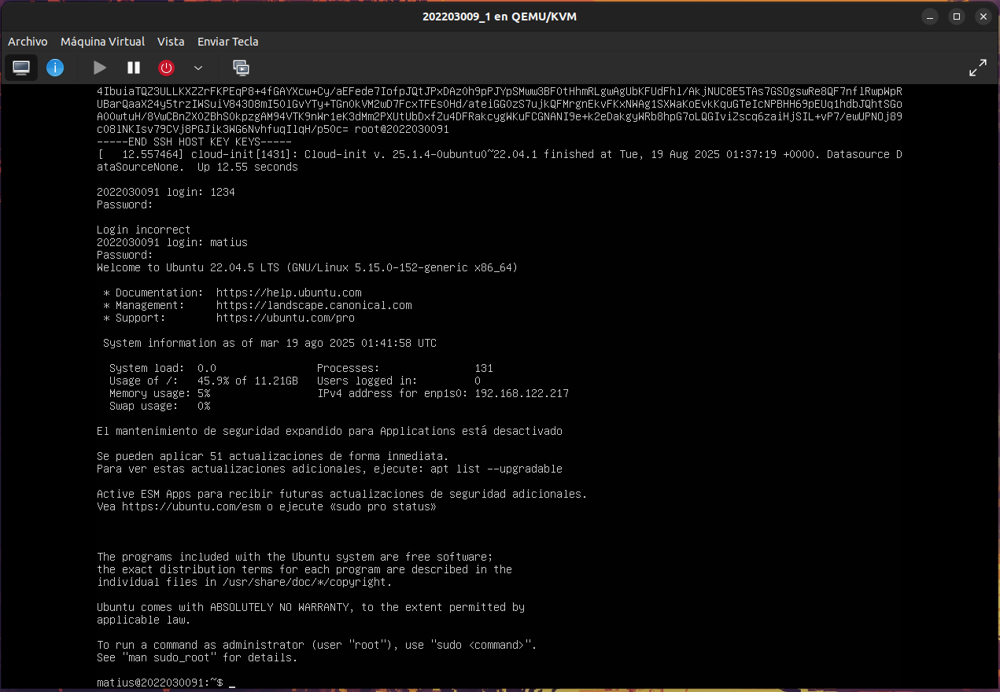
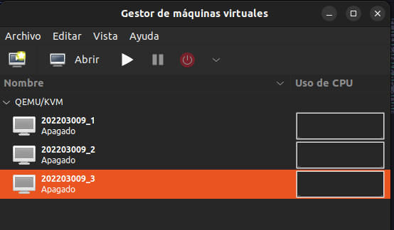

## Creacion maquinas virtuales

Para la creacion de las maquinas virtuales simplemente basta con abrir el gestor de maquinas virtuales que se instalo.

Una vez dentro se selecciona el boton de crear maquina virtual, donde se debera de seleccionar la imagen del archivo ISO que se utilizara para la instalacion del sistema.



Se nos muestra la configuracion de memoria para la maquina, modifique a su criterio.

posterior a ello, se nos muestran mas opciones para el almacenamiento de la maquina, que nuevamente vuelve a quedar al criterio del usuario.


Una vez realizada las configuraciones de memoria, se le asigna el nombre a la maquina virtual, en este caso al ser la primera de las tres maquinas que se deberan usar, se le asignara el `carnet_#`, por lo tanto para esta se usara `202203009_1`



Una vez realizado este paso se abrira una pantalla en la cual se debera seleccionar la primera opcion, es decir  `install Ubuntu Server`.


Se selecciona Ubuntu server y luego hecho.


Si el sistema necesita un proxy para conectar a internet debera de escribirse el proxy, sin embargo, en nuestro caso no es neceario, por lo que solo se omite, darle a `Hecho`.


Una vez realizadaos los pasos anteriores se muestran los detalles sobre la instalacion.


Se introducen los datos de la maquina virtual, en las tres maquinas virtuales se utilizo un usuario `matius`, el nombre del servidor tampoco es relevante, sin embargo, para tener un mejor orden y por ser esta la primer maquina, se le puso `carnet_#`, para este caso `202203009_1`, el nombre de usuario que tambien es indiferente, pero por facilidad se le pondra el mismo que se uso anteriormente `matius` y por ultimo una contrasenia, que tambien por facilidad se recomienda que sea una sencilla.


Posterior a ello, realizados todos estos pasos, se podra observar esta pantalla, solo darle `enter`.


Una vez hecho esto, la maquina quedara configurada para su uso.



Este proceso se repite para cada maquina, y con esto se tendran creadas tres maquinas, las cuales son:

- 202203009_1
- 202203009_2
- 202203009_3

con las mismas credenciales:
usuario: `matius`
contrasenia: `1234`



La creacion de dichas maquinas virtuales nos servira para hacer las respectivas conexiones que solicita el proyecto, el esquema a seguir es el siguiente:


En nuestro caso se decidio dividirlo de la siguiente manera:

- Maquina con 1 contenedor `202203009_1`
- Maquina 2 contenedores `202203009_2`
- Maquina 3 con zot `202203009_3`

Cabe mencionar que de las maquinas que tendran instalado docker son la maquina `host` y la `202203009_3` es decir, la maquina 3, de la misma manera la maquina 3 usara zot, en cuanto a las otras dos maquinas tendran docker y containerd.

En resumen, la maquina 3, contenera (valga la redundancia) los contenedores y se las suministrara a las otras dos maquinas, dichas vms ejecutaran los contendores y se conectaran entre si.

### Maquina 1 - 202203009_1
Para esta maquina,


### Maquina 3 - 202203009_3
Para dicha maquina, primero que nada se debe de instalar lo necesario para el proyecto, y para ello instalaremos docker.

esto lo haremos con los siguientes comandos:

**Nota**:
Recomiendo que para los comandos se utilice un medio que les facilite el ingreso de estos, puesto que hacerlo de otra manera puede que les complique un poco el proceso.

En este caso lo realice de la siguiente manera:

```bash
ssh usuario@IP_de_la_VM
```
Para conocer la IP de la maquina virtual basta con ingresar el siguiente comando en la terminal de la pc host:

```bash
virsh domifaddr nombre_de_la_VM
```
En este punto se abrira una terminal de la maquina virtual, donde podran ingresarse comando y copiar y pegar como se hace en la consola de la host.

``` bash
# Add Docker's official GPG key:
sudo apt-get update
sudo apt-get install ca-certificates curl
sudo install -m 0755 -d /etc/apt/keyrings
sudo curl -fsSL https://download.docker.com/linux/ubuntu/gpg -o /etc/apt/keyrings/docker.asc
sudo chmod a+r /etc/apt/keyrings/docker.asc

# Add the repository to Apt sources:
echo \
  "deb [arch=$(dpkg --print-architecture) signed-by=/etc/apt/keyrings/docker.asc] https://download.docker.com/linux/ubuntu \
  $(. /etc/os-release && echo "${UBUNTU_CODENAME:-$VERSION_CODENAME}") stable" | \
  sudo tee /etc/apt/sources.list.d/docker.list > /dev/null
sudo apt-get update
```

Adicional a ello, se recomiendo instalar instala Docker Engine y complementos:

```bash
sudo apt-get install docker-ce docker-ce-cli containerd.io docker-buildx-plugin docker-compose-plugin
```

Posterior a la instalacion se debe verificar que la instalacion este correctamente hecha, se hace de la siguiente manera:

```bash
sudo docker run hello-world
```

Si observa un mensaje de bienvenida, significa que la instalacion de Docker ha sido exitosa, de lo contrario, se recomienda seguir los pasos nuevamente.

Por ultimo, tenemos que hacer la configuracion de docker, que realmente este paso puede omitirse, pero por comodidad lo hare.

### Configuracion post-instalacion

Ahora ingresaremos el siguiente comando:

```bash
sudo usermod -aG docker $USER
```

Este comando le permite al usuario ejecutar docker sin necesidad de sudo, esto debido a que el socket /var/run/docker.sock pertenece al grupo docker.

Seguidamente, introducimos los siguientes comandos:

```bash
newgrp docker
```

Esto aplica inmediatamente los cambios de grupo en la sesion actual, sin esto se tendria que cerrar sesion y volver a entrar para que el usuario herede el grupo de docker, en palabras mas simples `recarga los gruos de usuario`.

```bash
sudo systemctl enable docker
```

Con este comando no se tiene que levantar manualmente con `systemctl start docker` tras cada reincio.

y para verificar el estado del servicio de docker solamente usamos:

```bash
sudo systemctl status docker
```

Una vez tengamos instalado docker, ahora podremos iniciar un registro `zot` en segundo plano, exponiendo el puerto 5000, para ello nos apoyaremos del siguiente comando:

```bash
docker run -d -p 5000:5000 --name zot ghcr.io/project-zot/zot-linux-amd64:latest
```

Con eso se descargara la imagen de `zot` y la ejecutara como un contenedor llamado `zot`. 

