# Sistemas Operativos 1
# Labortario de Sistemas Operativos 1
## Tarea 1
### Segundo Semestre 2025

```js
Universidad San Carlos de Guatemala

Programador:  Mateo Estuardo Diego Noriega
Carnet:       202203009
```

---

# Navegacion de directorios

## Distribucion
La presente tarea se trabaja bajo la distribucion de Ubuntu.

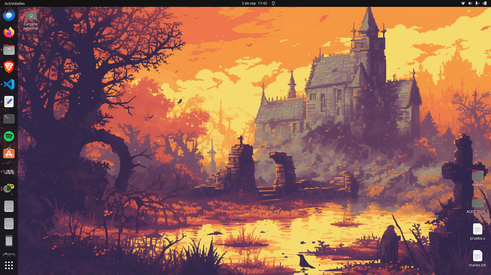

## Ejecucion de comandos

### ls
Para la ejecucion de dicho comando primero abriremos una terminal y escribiremos tal cual `ls` esto nos servira para observar los archivos y directorios que se tienen en el directorio actual.


### cd
Una vez nos hayamos ubicado con `ls` podemos apoyarnos de su resultado para realizar diferentes acciones, en este caso, usaremos `cd` para poder ingresar a un directorio. Dicho comando nos sirve para navegar entre directorios, es importante tomar en cuenta que este comando nos sirve tanto para entrar como para salir, para entrar usamos `cd NOMBRE_DIRECTORIO` para salir usamos `cd ..`.

En este caso ingresaremos a `Arduino`.

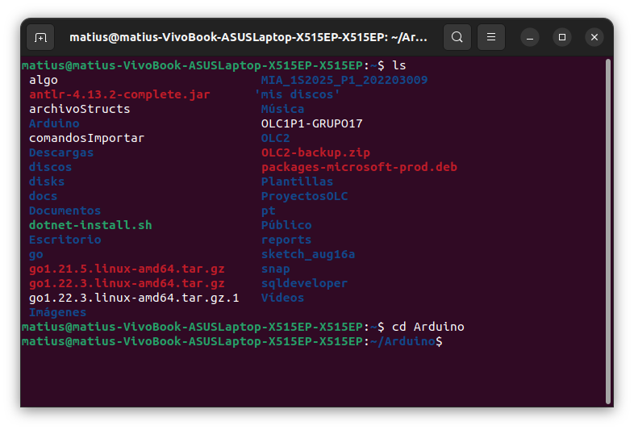

### pwd
Por ultimo nos apoyaremos de `pwd` para obtener la ruta absoluta del directorio actual.

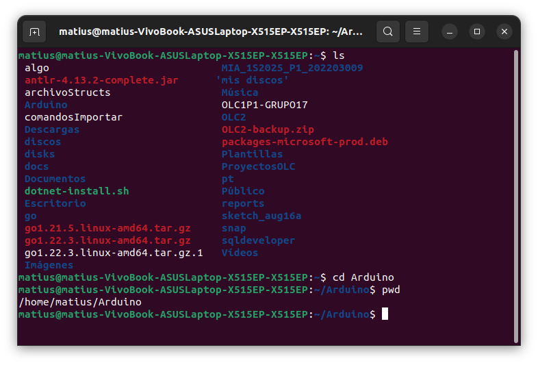


# Manipulacion de archivos

### touch
Para este comando basta con ingresar lo siguiente.

``js
touch NOMBRE_ARCHIVO
``
Dicho comando crea un archivo vacío o actualiza la fecha de modificación en caso de ya existir.

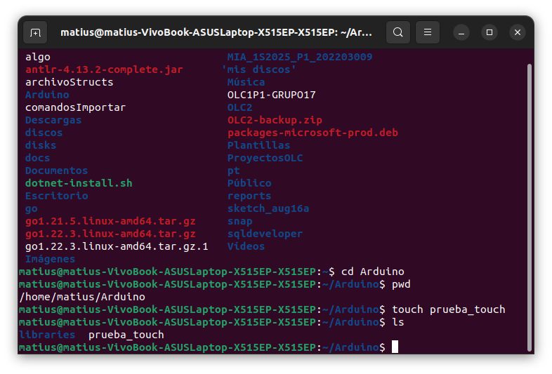

### cp
Este comando se encarga de copiar un archivo de la siguiente manera.

```js
cp ARCHIVO_A_COPIAR NOMBRE_DE_LA_COPIA
```

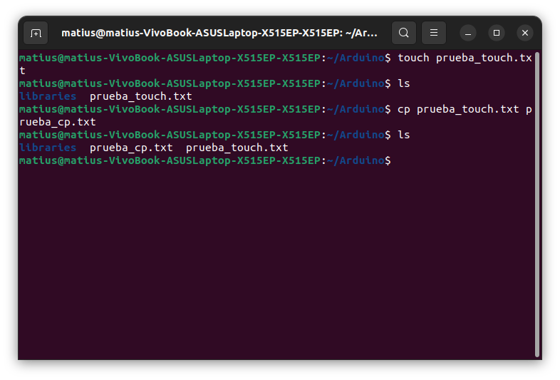

Lo que se hizo fue copiar una copia del archivo que se desea.

### mv
Este comando se encarga de mover archivos o renombrar un archivo

Para mover un archivo
```js
mv NOMBRE_ARCHIVO RUTA_A_MOVER
```

Para renombrar un archivo
```js
mv NOMBRE_ARCHIVO NOMBRE_NUEVO
```

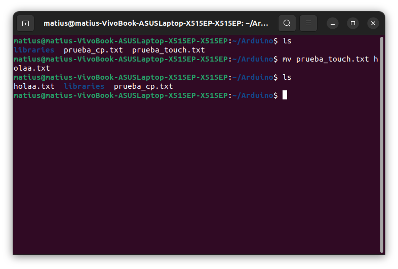

### rm
Este comando se encarga de eliminar un archivo.

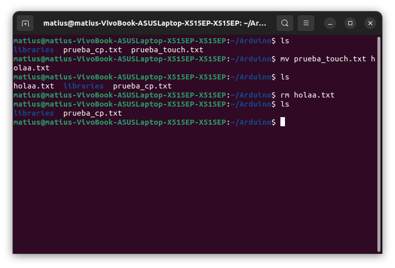


# Visualizacion de contenido

### cat
Este comando se encarga de mostrar el contenido de un archivo

```js
cat NOMBRE_ARCHIVO
```

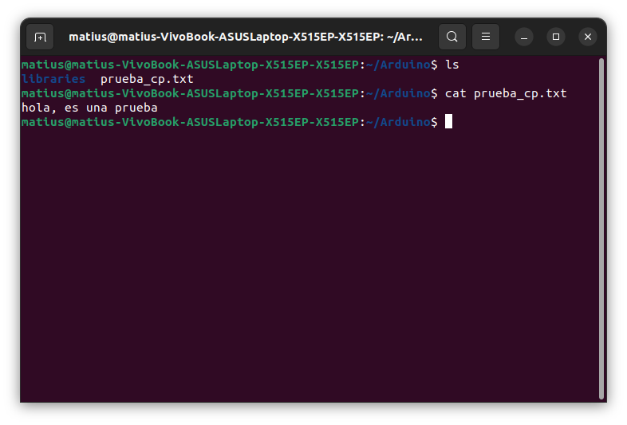

### more
Dicho comando muestra el contenido paginado (para avanzar con barra espaciadora).

```js
more NOMBRE_ARCHIVO
```

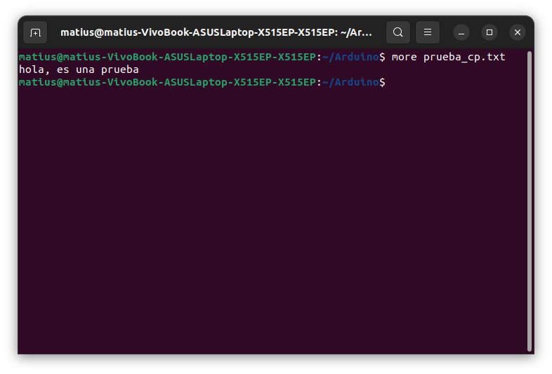

### less
Este comando es parecido a `more`, sin embargo, permite revisar y salir sin imprimir todo de golpe.

```js
less NOMBRE_ARCHIVO
```

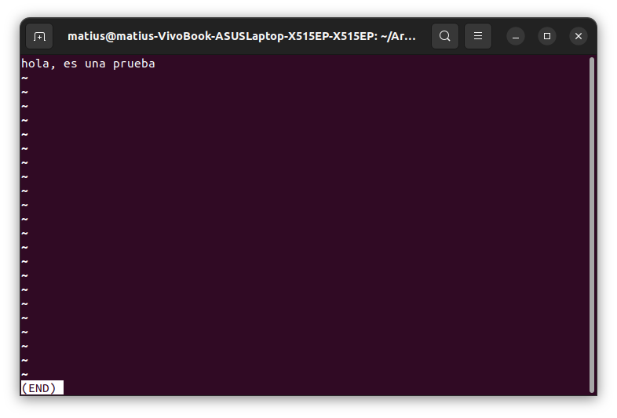

# Gestion de permisos

### chmod
Este comando agrega permiso de ejecución al dueño del archivo.

```js
chmod MODO/PERMISO NOMBRE_ARCHIVO
```

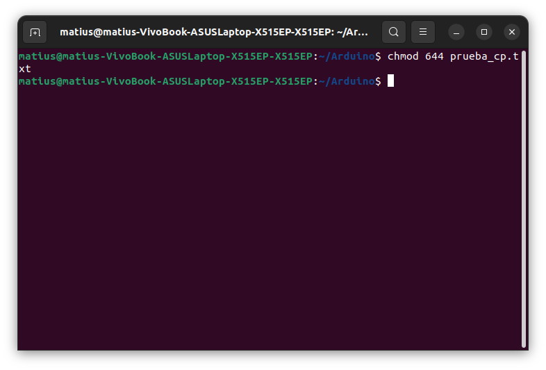

### chown
Este comando se encarga de copiar un archivo de la siguiente manera.

```js
chown $USUARIO:$USUARIO NOMBRE_ARCHIVO
```

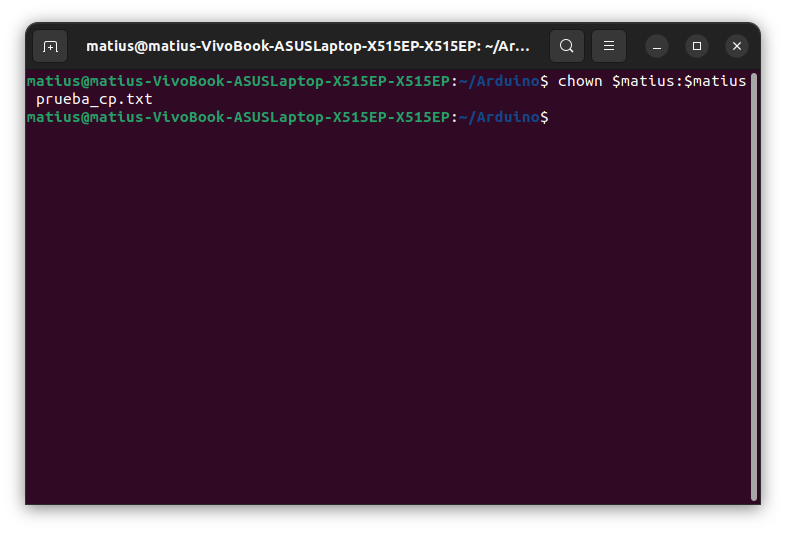

# Script

```bash
#!/usr/bin/env bash
set -euo pipefail

CARNET="202203009"

# --- cantidad aleatoria de archivos: 1..4 ---
COUNT="$(shuf -i 1-4 -n 1)"

rand_name() {
  # genera 8 letras aleatorias [a-z]
  tr -dc 'a-z' </dev/urandom | head -c 8
}

echo "Creando ${COUNT} contenedores en: $(pwd)"
for ((i=1; i<=COUNT; i++)); do
  NAME="$(rand_name)"
  FILENAME="contenedor_${CARNET}_${NAME}.txt"
  printf '%s\n' "$FILENAME" > "$FILENAME"
  echo "Creado: $FILENAME"
done

echo "Listo."

```

para ejecutar el script primero debemos darle permisos de ejecucion, lo hacemos de la siguiente manera:

```bash
chmod +x simulacion_crear_contenedores.sh
```

y para ejecutarlo basta con poner en la consola lo siguiente:

```bash
./simulacion_crear_contenedores.sh
```

Una vez ejecutado, se abran creado contenedores con mis datos personales, es decir, mi carnet.